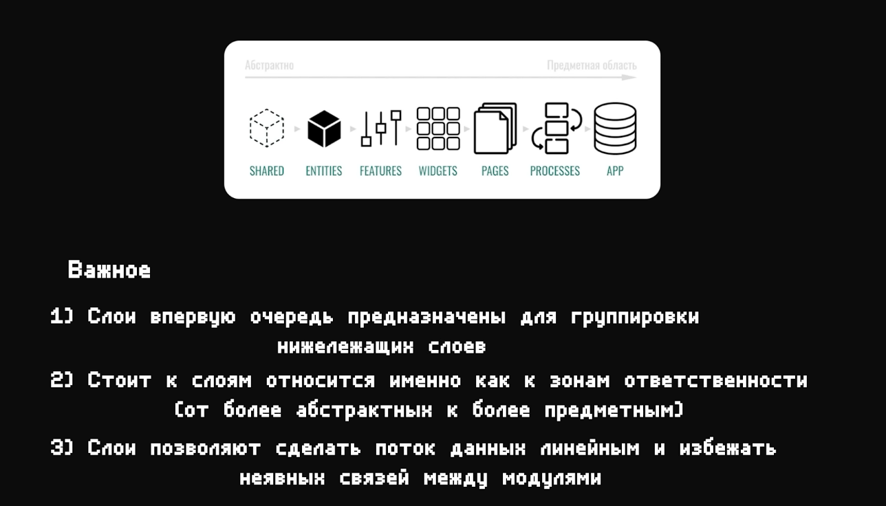

https://youtu.be/c3JGBdxfYcU

1. Classic No architecture
2. Model simple PUBLIC API (инкапсуляция)
3. Atomic design
4. Feature sliced design (модульная на стеройдах)
   
   
   
   
5. Микрофронтенд + монорепа + модульная

