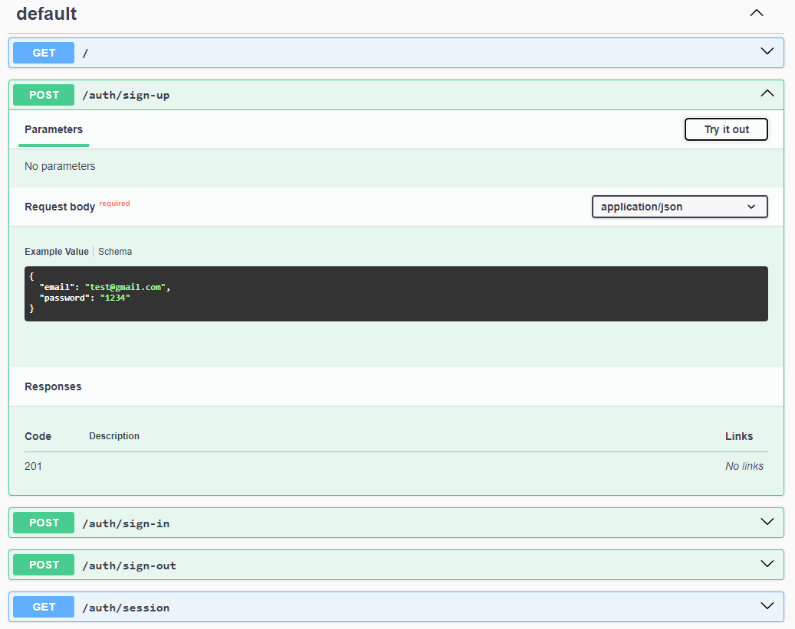

https://youtu.be/vrjPzp-bZJo?t=2296


npx nest g mo auth
npx nest g co auth
npx nest g s auth --no-spec
npx nest g mo users
npx nest g s users --no-spec

cd src/auth/
npx nest g s password --no-spec --flat
npx nest g s cookie --no-spec --flat
npx nest g gu auth --no-spec --flat

# prisma/schema.prisma
```
generator client {
  provider = "prisma-client-js"
}
datasource db {
  provider = "postgresql"
  url      = env("DATABASE_URL")
}
model User {
  id    Int    @id @default(autoincrement())
  email String @unique
  hash  String
  salt  String
}
```
# /server
npx prisma db push
npx prisma generate

# src/users/users.service.ts
```typescript
import { Injectable } from '@nestjs/common';
import { DbService } from 'src/db/db.service';
@Injectable()
export class UsersService {
  constructor(
    private db: DbService) {}

  findByEmail(email: string) {
    return this.db.user.findFirst({ where: { email } });
  }

  async create(email: string, hash: string, salt: string) {
    const user = await this.db.user.create({ data: { email, hash, salt } });
  }
}
```

# src/users/users.module.ts
```typescript
import { Module } from '@nestjs/common';
import { UsersService } from './users.service';
import {DbModule} from "../db/db.module";

@Module({
  imports: [DbModule],
  providers: [UsersService],
  exports: [UsersService],
})
export class UsersModule {}
```

# src/auth/auth.module.ts
```typescript
import { Module } from '@nestjs/common';
import { AuthController } from './auth.controller';
import { AuthService } from './auth.service';
import { PasswordService } from './password.service';
import { CookieService } from './cookie.service';
import { UsersModule } from 'src/users/users.module';


@Module({
    imports: [
        UsersModule,
    ],
    controllers: [AuthController],
    providers: [AuthService, PasswordService, CookieService],
})
export class AuthModule {}
```

# src/auth/auth.controller.ts
```typescript
import {Controller, Get, HttpCode, HttpStatus, Post} from '@nestjs/common';
@Controller('auth')
export class AuthController {
    @Post('sign-up')
    signUp() {}

    @Post('sign-in')
    @HttpCode(HttpStatus.OK)
    signIn() {}

    @Post('sign-out')
    @HttpCode(HttpStatus.OK)
    signOut() {}

    @Get('session')
    getSessionInfo() {}
}
```


# create src/auth/dto.ts
```typescript
import { ApiProperty } from '@nestjs/swagger';
export class SignUpBodyDto {
    @ApiProperty({
        example: 'test@gmail.com',
    })
    email: string;

    @ApiProperty({
        example: '1234',
    })
    password: string;
}
export class SignInBodyDto {
    @ApiProperty({
        example: 'test@gmail.com',
    })
    email: string;

    @ApiProperty({
        example: '1234',
    })
    password: string;
}
export class GetSessionInfoDto {
    @ApiProperty()
    id: number;

    @ApiProperty()
    email: string;
}
```

# src/auth/auth.controller.ts
```typescript
import {Body, Controller, Get, HttpCode, HttpStatus, Post} from '@nestjs/common';
import {GetSessionInfoDto, SignInBodyDto, SignUpBodyDto} from "./dto";
import {ApiCreatedResponse, ApiOkResponse} from "@nestjs/swagger";
@Controller('auth')
export class AuthController {
    @Post('sign-up')
    @ApiCreatedResponse()
    signUp(@Body() body: SignUpBodyDto) {
        return null;
    }
    @Post('sign-in')
    @ApiOkResponse()
    @HttpCode(HttpStatus.OK)
    async signIn(@Body() body: SignInBodyDto) {
        return null;
    }
    @Post('sign-out')
    @HttpCode(HttpStatus.OK)
    @ApiOkResponse()
    signOut() {}
    @Get('session')
    @ApiOkResponse({
        type: GetSessionInfoDto,
    })
    getSessionInfo() {
        return null;
    }
}
```

# FINISH = 


