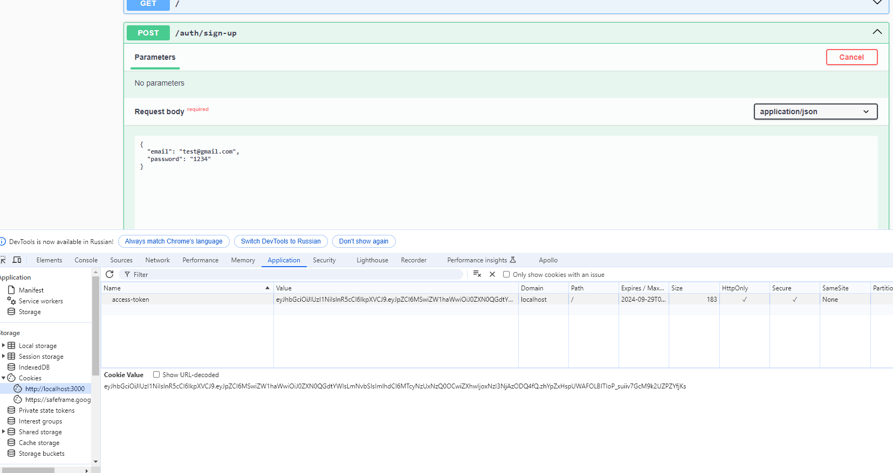

$ npm i @nestjs/jwt cookie-parser
$ npm i -D @types/cookie-parser
$ npm i class-validator class-transformer

# src/auth/auth.service.ts
```typescript


```


# FINISH 1  https://youtu.be/vrjPzp-bZJo?t=4146